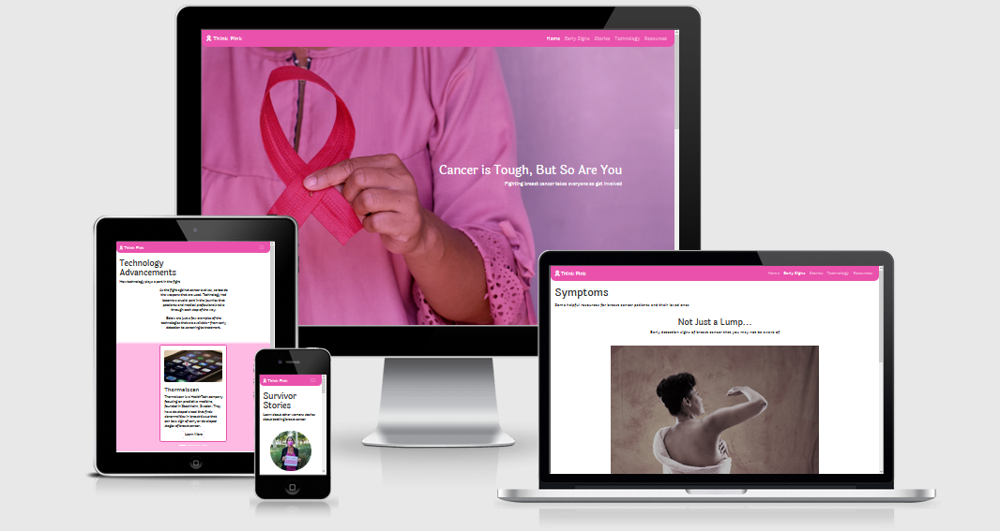
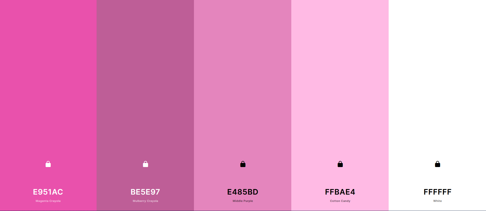
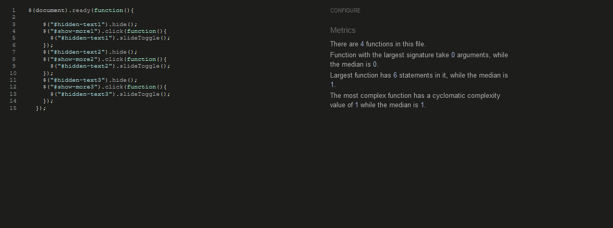
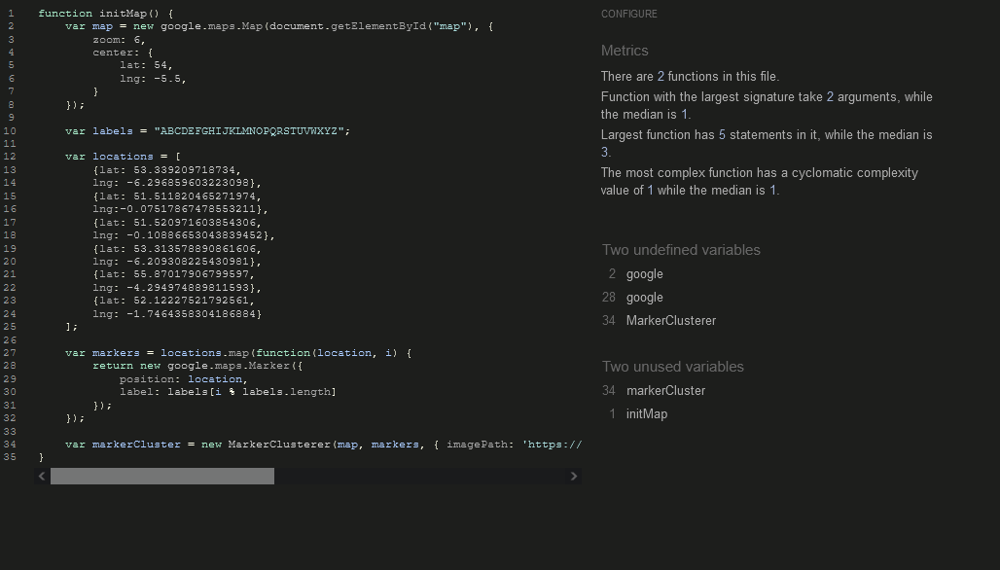

# HACKATHON PROJECT - Think Pink

[Here is a link to the final project](https://manni8436.github.io/Think-Pink/)

## INITIAL DESIGN
* The initial idea behind this project is to create a website on up and coming technologies on early breast cancer screening, while raising breast cancer awareness. Target audience is anyone who wants to get information regarding breast cancer and new ways for early diagnosis and possible prevention.

## FINAL DESIGN

## CONTENTS

* [User Experience](#USER-EXPERIENCE)  
    * [User Stories](#USER-STORIES)    

* [Design](#DESIGN)   
    * [Color Scheme](#COLOR-SCHEME)

* [Wireframes](#WIREFRAMES) 

* [Technologies Used](#TECHNOLOGIES-USED) 
    * [Languages Used](#LANGUAGES-USED)
    * [Programs Used](#PROGRAMS-USED)

* [Deployment](#DEPLOYMENT)
    * [Initial Deployment](#INITIAL-DEPLOYMENT)
    * [How To Fork A Repository](#HOW-TO-FORK-A-REPOSITORY)
    * [How To Clone A Repository](#HOW-TO-CLONE-A-REPOSITORY)
    * [How To Make A Local Clone](#HOW-TO-MAKE-A-LOCAL-CLONE)

* [Testing](#TESTING)
    * [Code Validators](#CODE-VALIDATORS)

* [Content](#CONTENT)
    * [Images](#IMAGES)
    * [Text Content](#TEXT-CONTENT)

* [Acknowledgements](#ACKNOWLEDGEMENTS)    

## USER EXPERIENCE
The structure of the site was designed to be simple and easy to use. It has a good balance of images and content, so it does not overload the user, while giving the user
enough information on possible techonologies, how to detect possible breast cancer, also some success stories on people in tech today who have survived cancer.

* The website is for the following user types:
    * Users with no previous experience about breast cancer, and would like more information.
    * Users with basic experience about breast cancer.
    * Users who wish to get information on new prescreening technologies.

## USER STORIES

#### CLIENT GOALS
* The site needs to be easily accessible.
* The navigation menu needs to be simple to use on a range of devices, including desktops, tablets and mobiles.
* Manoeuvering around the site should be simple and straightforward.
* The site should be informative and all the text should be easy to read.
* The images should be clear and not stretched or squashed.

#### SITE USER
* I want it to be easy to understand how to navigate throughout the site.
* I want the content to be easily comprehensible.
* I want images to be clearly visible.

## DESIGN

### COLOR SCHEME

The overall colour scheme used throughout the site can be seen in the colour palette below.

## WIREFRAMES

[Here are our wireframes for desktop, mobile and tablet for this project](assets/wireframes/WIT-Hackathon-wireframes.pdf)

## FEATURES

The following features have been used in this project:
   
* A Carousel has been used to display technologies for prescreening of breast cancer.
* An API map has been used to show different locations of support center around the country.

## SOLVED BUGS

## TECHNOLOGIES USED

###  LANGUAGES USED

       

### PROGRAMS USED:

#### Font Awesome:
[Font Awesome](https://fontawesome.com/) was used for a few icons in the footer on all of this site's pages.

#### Google Fonts:
[Google Fonts](https://fonts.google.com/) was used for all the text content on the site pages.

#### Git:
[Git](https://git-scm.com/) was used for version control by using the Gitpod terminal to add and commit to Git and push to Github.

#### GitPod:
[GitPod](https://gitpod.io) was used as an IDE whilst coding this site.
    
#### GitHub:
[GitHub](https://github.com/) is being used to store all the code for this project after being pushed from GitPod.

#### Am I Responsive:
[Am I Responsive](http://ami.responsivedesign.is/) was used to create the image in our [Final Design](#FINAL-DESIGN) section.

#### Balsamiq:
[Balsamiq](https://balsamiq.com/) was used in the initial design process to make wireframes.

## DEPLOYMENT:

### INITIAL DEPLOYMENT

This site was deployed using GitHub Pages with the following the steps below:

1. Login or Sign Up to [GitHub](www.github.com).
2. Create a new repository named "Think-Pink".
3. Once created, click on "Settings" on the navigation bar under the repository title.
4. Click on "Pages", on the left hand side below Secrets.
5. Under "Source", choose which branch you wish to deploy, In most cases it will be "main".
6. Choose which folder to deploy from, generally from "/root".
7. Click "Save", then wait for it to be deployed. It may take some time for the page to be fully deployed.
8. The URL will be displayed above the "source" section in GitHub Pages.

### HOW TO FORK A REPOSITORY

If you need to make a copy of a repository:

1. Login or Sign Up to [GitHub](www.github.com).
2. On GitHub, go to "Think-Pink".
3. In the top right corner, click "Fork".

### HOW TO CLONE A REPOSITORY

If you need to make a clone:    

1. Login in to [GitHub](www.github.com).
2. Fork the repository "Think-Pink" using the steps above in [How To Fork a Repository](#HOW-TO-FORK-A-REPOSITORY).
3. Above the file list, click "Code".
4. Choose if you want to close using HTTPS, SSH or GitHub CLI, then click the copy button to the right.
5. Open Git Bash.
6. Change the directory to where you want your clone to go.
7. Type git clone and then paste the URL you copied in step 4.
8. Press Enter to create your clone.

### HOW TO MAKE A LOCAL CLONE

If you need to make a local clone:   

1. Login in to [GitHub](www.github.com).
2. Under the repository name, above the list of files, click "Code".
3. Here you can either Clone or Download the repository.
4. You should close the repository using HTTPS, clicking on the icon to copy the link.
5. Open Git Bash.
6. Change the current working directory to the new locaiton, where you want the cloned directory to be.
7. Type git clone and then paste the URL you copied in step 4.
8. Press Enter, and your local clone will be created.

## TESTING

### CODE VALIDATORS

The W3C Markup Validator and W3C CSS Validator was used to validate our project to make sure there were no errors within the site.

* W3C HTML Validator Results
    * [Home Page](https://validator.w3.org/nu/?doc=https%3A%2F%2Fmanni8436.github.io%2FThink-Pink%2Findex.html)
    * [Early Signs Page](https://validator.w3.org/nu/?doc=https%3A%2F%2Fmanni8436.github.io%2FThink-Pink%2Fsymptoms.html)
    * [Stories Page](https://validator.w3.org/nu/?doc=https%3A%2F%2Fmanni8436.github.io%2FThink-Pink%2Fstories.html)
    * [Technology Page](https://validator.w3.org/nu/?doc=https%3A%2F%2Fmanni8436.github.io%2FThink-Pink%2Ftechnology.html)
    * [Resources Page](https://validator.w3.org/nu/?doc=https%3A%2F%2Fmanni8436.github.io%2FThink-Pink%2Fresources.html)
* W3C CSS Validator Results
    * [Home Page](https://jigsaw.w3.org/css-validator/validator?uri=https%3A%2F%2Fmanni8436.github.io%2FThink-Pink%2Findex.html&profile=css3svg&usermedium=all&warning=1&vextwarning=&lang=en)
    * [Early Signs Page](https://jigsaw.w3.org/css-validator/validator?uri=https%3A%2F%2Fmanni8436.github.io%2FThink-Pink%2Fsymptoms.html&profile=css3svg&usermedium=all&warning=1&vextwarning=&lang=en)
    * [Stories Page](https://jigsaw.w3.org/css-validator/validator?uri=https%3A%2F%2Fmanni8436.github.io%2FThink-Pink%2Fstories.html&profile=css3svg&usermedium=all&warning=1&vextwarning=&lang=en)
    * [Technology Page](https://jigsaw.w3.org/css-validator/validator?uri=https%3A%2F%2Fmanni8436.github.io%2FThink-Pink%2Ftechnology.html&profile=css3svg&usermedium=all&warning=1&vextwarning=&lang=en)
    * [Resources Page](https://jigsaw.w3.org/css-validator/validator?uri=https%3A%2F%2Fmanni8436.github.io%2FThink-Pink%2Fresources.html&profile=css3svg&usermedium=all&warning=1&vextwarning=&lang=en)

* JavaScript Validator
    * 
    * 

### FULL TESTING

[Click Here](TESTING.md) to view the full testing steps that were completed on every device and browser.

### LIGHTHOUSE

#### Initial Score

#### Performance:

* Performance was 100% so didn't need to be adjusted

#### Accessibility:

* Contrast on the nav bar was low
   * Used a darker colour for the background
   * Used solid white for all links
   * Used underline & bold for active links

#### Best Practices:

* "Front ended libraries included may have vulnerabilities"
   * Bootstrap is an important part of making the site responsive so it cannot be removed 

#### SEO:

* Non decscriptive button name
   * Updated button/link names

### Final Lighhouse Scores

* Desktop

* Mobile

## CREDITS

* Code for caoursel next and previous buttons taken from [here](https://forum.freecodecamp.org/t/bootstrap-carousel-controls-color/331196/2)

* Homepage stats taken from [WHO](https://www.who.int/news-room/fact-sheets/detail/breast-cancer)

* Survivor stories (and their images) taken from [Lee Health](https://www.leehealth.org/health-and-wellness/healthy-news-blog/cancer-care/breast-cancer-stories-of-survival-courage-and-inspiration)

* Technology page information & images taken from each site:
   * [Breast Aware App](https://www.breastcancerireland.com/education-awareness/free-to-download-app/)
   * [TNM Cancer Staging App](https://www.iaea.org/newscenter/news/embracing-mobile-and-online-technology-to-reshape-cancer-care-and-education)
   * [Transpara (ScreenPoint Medical)](https://www.siemens-healthineers.com/perspectives/mso-ai-in-mammography.html)
   * [Thermaiscan](https://thermaiscan.com//)

* Resource information & images taken from their sites:

   * [Irish Cancer Society](https://www.cancer.ie/)
   * [Breast Cancer Now](https://breastcancernow.org/)
   * [Breast Cancer Haven](https://www.breastcancerhaven.org.uk/)
   * [ARC](https://www.arccancersupport.ie/services-for-you/family-loved-ones/)
   * [Maggie's Centers](https://www.maggies.org/)
   * [Inflammatory Breast Cancer Support](https://ibcnetworkuk.org/)

* Hero image taken from [Unsplash](https://unsplash.com/photos/SJCalEw-1LM)
* Home page banner image taken from [Unsplash](https://unsplash.com/photos/XJXWbfSo2f0)
* Symptoms page image taken from [Unsplash](https://unsplash.com/photos/ICm-cEIFk4I)